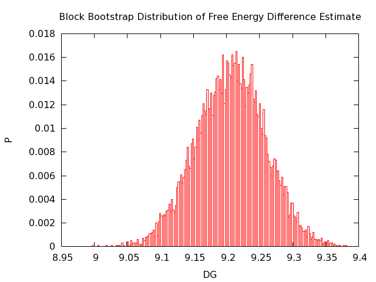

#Thermodynamic Integration Utility

##About

This utility is designed to be used with GROMACS output from a set of free
energy simulations. This program calculates free energy difference estimates
through thermodynamic integration. Additionally it calculates uncertainty in the
estimate through a bootstrap calculation.

Note that GROMACS already comes with a way to calculate free energy estimates
with the Bennett Acceptance Ratio using "gmx bar", so you should check that out
as well, since unlike this project, it is reviewed by several developers in the
field (thus far this code has been reviewed by just myself).

##Prerequisites

You need Boost and GROMACS.

##Installation

    git clone https://github.com/wesbarnett/thermint
    cd thermint 
    mkdir build
    cd build
    cmake ..
    make -j 4
    make install

The GMXPREFIX environmental variable is used to find the GROMACS install
location. Either set it manually or [source the GMXRC file in your GROMACS
installation](http://www.gromacs.org/Documentation/Installation_Instructions#Getting_access_to_GROMACS_after_installation).

Also note that if you use gcc the bootstrap calculation will be compiled to run
in parallel using OpenMP automatically.

##Running

By default the program uses the trapezoid method for the integration, but
Simpson's rule and Gaussian-Legendre quadrature are also available. Beware that
in order to use Gaussian-Legendre quadrature for the integration you must have
run your simulations at the appropriate lambdas. Both the trapezoid rule and
Simpson's method do not require specific lambdas. Equal spacing of simulations
for trapezoid rule and Simpson's method is not required.

When running the integration calculation you must specify the energy files. **In
order use this utility you must have set separate-dhdl-file as 'no' in your mdp
files.**  If you had it set as 'yes' (the default), you're out of luck with that
set of simulations (sorry), so if you want to use this utility, run them again
with the option set to 'no'. The easiest way to specify the files is to do the
following: If 'ener' is the common prefix of all of your energy files, do:

    thermint -f ener*.edr
            
Note that dV/dl, which is required for the integration, is read in directly from
the energy files so that **the output frequency of these values from your
simulation was determined by the nstenergy variable in your mdp file**.

As mentioned above the standard error is estimated using a bootstrap
calculation. The number of iterations in the bootstrap calculation can be
changed with --nboot. By default 1000 iterations are performed to get the
bootstrapped average and then variance. Block bootstrapping is used, such that
each set of dV/dl is split up into several blocks (5 by default) which are
randomly selected with replacement for each free energy calculation. Five blocks
are chosen by default under the assumption that your simulation will be at least
five times the correlation time. The standard error is then estimated to be the
bootstrap standard deviation. The number of blocks can be changed with
--nblocks. Choosing too many blocks will give an uncertainty which is much lower
than the true uncertainty.

When you run the program it will tell you which group (right now coul, vdw,
mass, or restraint) and the lambda values and the file. At the end of the
calculation you'll get a breakdown of the results along with the total free
energy change estimate and uncertainty.

##Example

Here are example results from adding an OPLS methane (both vdw and electrostatic
parameters) to tip3p water using Simpson's rule with 10,000 bootstrap iterations
with five blocks. The first 10 simulations the vdw parameters varied and the
last 10 the Coulomb ones did.

````
Results in kJ/mol
coul:
Sim    lambda  <dVcoul/dl> ±  std.dev.      weight  w*<dVcoul/dl>      tot
  1     0.000      -0.534 ±  123.097       0.000      -0.000       0.000
  2     0.000      -0.032 ±  121.891       0.000      -0.000       0.000
  3     0.000       0.758 ±  106.456       0.000       0.000       0.000
  4     0.000      -0.259 ±   74.810       0.000      -0.000       0.000
  5     0.000      -0.492 ±   13.991       0.000      -0.000       0.000
  6     0.000       0.056 ±    2.416       0.000       0.000       0.000
  7     0.000       0.080 ±    1.067       0.000       0.000       0.000
  8     0.000       0.090 ±    0.865       0.000       0.000       0.000
  9     0.000       0.074 ±    0.759       0.000       0.000       0.000
 10     0.000       0.069 ±    0.687       0.000       0.000       0.000
 11     0.000       0.069 ±    0.632       0.033       0.002       0.002
 12     0.100       0.055 ±    0.632       0.133       0.007       0.010
 13     0.200       0.031 ±    0.634       0.067       0.002       0.012
 14     0.300       0.014 ±    0.641       0.133       0.002       0.014
 15     0.400       0.002 ±    0.645       0.067       0.000       0.014
 16     0.500      -0.017 ±    0.645       0.133      -0.002       0.011
 17     0.600      -0.031 ±    0.643       0.067      -0.002       0.009
 18     0.700      -0.049 ±    0.639       0.133      -0.007       0.003
 19     0.800      -0.064 ±    0.654       0.067      -0.004      -0.001
 20     0.900      -0.087 ±    0.657       0.133      -0.012      -0.013
 21     1.000      -0.099 ±    0.658       0.033      -0.003      -0.016

vdw:
Sim    lambda  <dVvdw/dl> ±  std.dev.      weight  w*<dVvdw/dl>      tot
  1     0.000      -0.008 ±    4.266       0.033      -0.000      -0.017
  2     0.100      10.796 ±    7.776       0.133       1.439       1.423
  3     0.200      23.565 ±   14.874       0.067       1.571       2.994
  4     0.300      30.114 ±   26.138       0.133       4.015       7.009
  5     0.400      19.823 ±   28.326       0.067       1.322       8.331
  6     0.500       8.852 ±   21.850       0.133       1.180       9.511
  7     0.600       3.710 ±   18.102       0.067       0.247       9.758
  8     0.700       0.641 ±   15.783       0.133       0.086       9.844
  9     0.800      -1.611 ±   14.056       0.067      -0.107       9.736
 10     0.900      -2.971 ±   12.957       0.133      -0.396       9.340
 11     1.000      -4.039 ±   12.093       0.033      -0.135       9.206
 12     1.000      -4.037 ±   12.141       0.000      -0.000       9.206
 13     1.000      -3.960 ±   12.220       0.000      -0.000       9.206
 14     1.000      -3.974 ±   12.155       0.000      -0.000       9.206
 15     1.000      -3.961 ±   12.170       0.000      -0.000       9.206
 16     1.000      -3.968 ±   12.231       0.000      -0.000       9.206
 17     1.000      -3.947 ±   12.117       0.000      -0.000       9.206
 18     1.000      -4.104 ±   12.119       0.000      -0.000       9.206
 19     1.000      -4.000 ±   12.084       0.000      -0.000       9.206
 20     1.000      -4.213 ±   11.923       0.000      -0.000       9.206
 21     1.000      -4.080 ±   12.111       0.000      -0.000       9.206

Doing bootstrap calculation for uncertainty (could take a few minutes)...

total: 9.206 ± 0.056 kJ/mol
````
And here's the histogram from the bootstrap calculation:


##Resources

* M. R. Shirts and D. L. Mobley, "An introduction to best practices in free energy
calculations", in Biomolecular Simulations: Methods and Protocols, Methods in
Molecular Biology 924:271-311 (2013). 
* J. A. Lemkul, ["GROMACS Tutorial: Free Energy Calculations: Methane in
Water"](http://www.bevanlab.biochem.vt.edu/Pages/Personal/justin/gmx-tutorials/free_energy/index.html).

